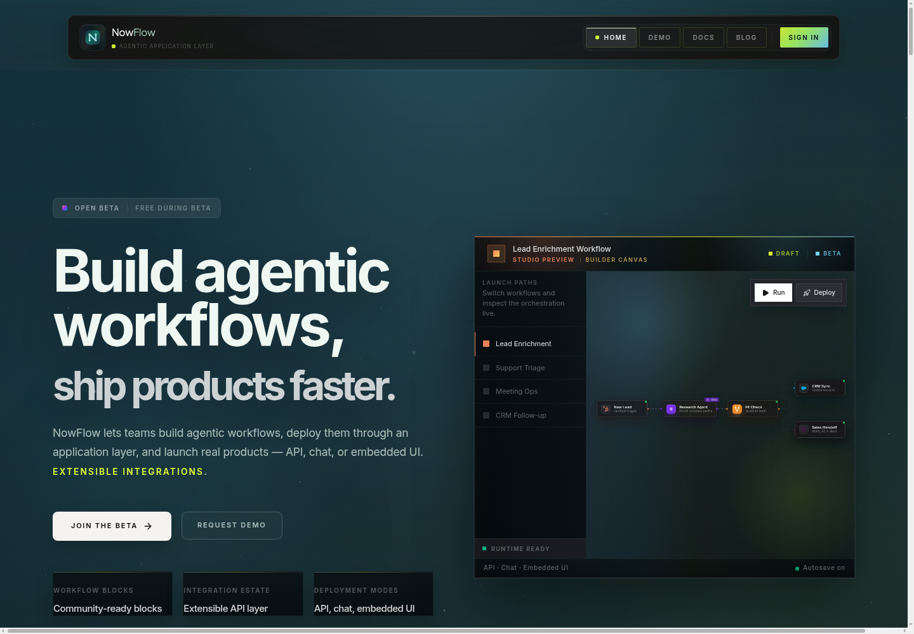
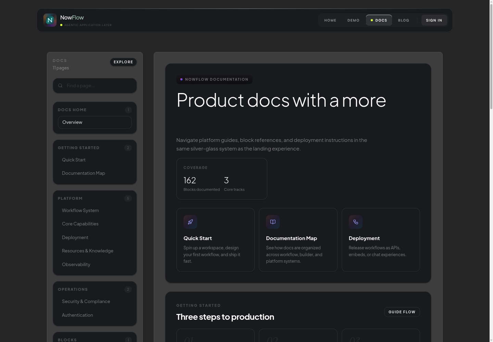
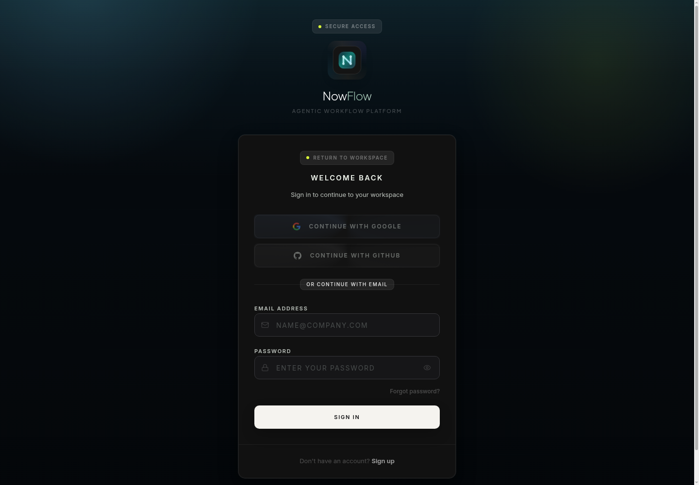
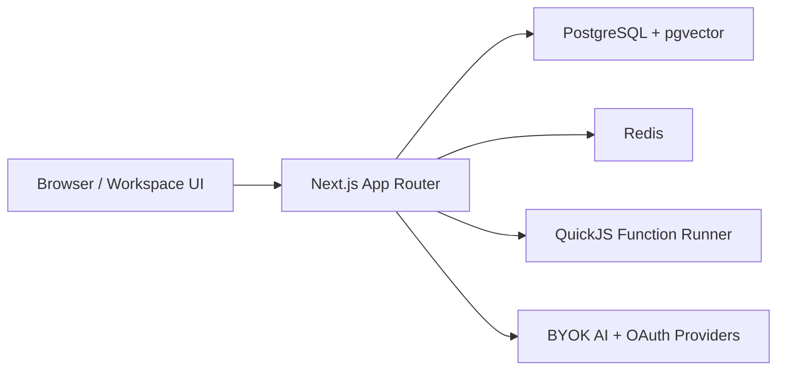

<p align="center">
  
</p>

<h1 align="center">NowFlow Community Edition</h1>

<p align="center">
  Open-source visual workflow automation for AI blocks, integrations, human review steps,
  data tables, knowledge workflows, and self-hosted execution.
</p>

<p align="center">
  <a href="./LICENSE"></a>
  
  
  
  
  
</p>

<p align="center">
  <a href="#quick-start">Quick Start</a>
  ·
  <a href="#screenshots">Screenshots</a>
  ·
  <a href="#community-scope">Community Scope</a>
  ·
  <a href="#architecture">Architecture</a>
  ·
  <a href="#contributing">Contributing</a>
</p>



## What Is NowFlow Community?

NowFlow Community is the open-source edition of NowFlow. It is designed for
developers and teams who want to run a local or self-hosted workflow builder
without managed enterprise surfaces.

Use it to:

- Design workflows visually with blocks, edges, utility blocks, and sub-block
  configuration.
- Connect AI providers with bring-your-own-key settings.
- Build human-in-the-loop approval flows.
- Store workflow data in tables, files, and knowledge sources.
- Run JavaScript function blocks in the Community QuickJS sandbox.
- Deploy local workflow surfaces such as APIs, forms, embeds, and chat-style
  interfaces where enabled by the app.

Enterprise capabilities are presented as upgrade paths and point to
[nowflow.io](https://nowflow.io).

## Screenshots

| Home                                                                     | Docs                                                                           |
| ------------------------------------------------------------------------ | ------------------------------------------------------------------------------ |
|  |  |

| Auth and first-run gate                                                 |
| ----------------------------------------------------------------------- |
|  |

## Quick Start

### Prerequisites

- Node.js 22 or newer
- npm 11 or newer
- PostgreSQL 16 with pgvector
- Redis 7, optional but recommended for local parity

### 1. Install Dependencies

```bash
npm install
```

### 2. Configure Environment

```bash
cp .env.example .env
```

Fill the required local values in `.env`:

```bash
DATABASE_URL=<local-postgres-url>
POSTGRES_URL=<local-postgres-url>
BETTER_AUTH_SECRET=<random-32-byte-secret>
ENCRYPTION_KEY=<random-32-byte-secret>
NEXT_PUBLIC_APP_URL=http://localhost:3000
BETTER_AUTH_URL=http://localhost:3000
NEXT_PUBLIC_ENTERPRISE_URL=https://nowflow.io
```

Generate local secrets with:

```bash
openssl rand -base64 32
```

### 3. Start Local Services

With Docker Compose:

```bash
POSTGRES_PASSWORD="$(openssl rand -base64 24)" \
BETTER_AUTH_SECRET="$(openssl rand -base64 32)" \
ENCRYPTION_KEY="$(openssl rand -base64 32)" \
docker compose up --build
```

Or run only the database and start the app manually:

```bash
docker compose up -d db
npm --workspace apps/nowflow run db:push
npm --workspace apps/nowflow run dev
```

### 4. Create the First Owner

Open:

```text
http://localhost:3000/setup
```

Create the first user. Setup is a one-time gate: after the first account exists,
the setup route returns users to normal authentication.

## Common Commands

| Command                                    | Description                                 |
| ------------------------------------------ | ------------------------------------------- |
| `npm run dev`                              | Start the NowFlow web app through Turborepo |
| `npm --workspace apps/nowflow run dev`     | Start only the Next.js app                  |
| `npm --workspace apps/nowflow run db:push` | Push the Drizzle schema to PostgreSQL       |
| `npm run build`                            | Build all workspaces                        |
| `npm run check-types`                      | Run TypeScript checks                       |
| `npm --workspace apps/nowflow run lint`    | Run ESLint for the app                      |
| `npm --workspace apps/nowflow run test`    | Run the Vitest suite                        |
| `npm run format:check`                     | Check formatting                            |

## Community Scope

This repository is intentionally scoped for the open-source Community Edition.

Included:

- Next.js web app in `apps/nowflow`
- Drizzle schema and PostgreSQL runtime
- BYOK provider settings for supported AI providers
- Local Ollama integration
- Community workflow blocks and integrations
- QuickJS-based JavaScript execution
- Community docs, examples, and setup flow

Not included in Community:

- Native mobile application projects
- Managed cluster deployment manifests
- Managed tenant operations
- Managed identity provider implementation
- Hosted meta-build tooling
- Managed web-search agents
- Enterprise deployment and governance surfaces

Enterprise requests use `NEXT_PUBLIC_ENTERPRISE_URL` and default to
[https://nowflow.io](https://nowflow.io).

## Architecture



## Repository Layout

```text
.
├── apps/
│   └── nowflow/          # Next.js app, API routes, workflow UI, blocks
├── packages/             # Shared packages used by the app
├── docs/                 # Community docs and README assets
├── docker-compose.yml    # Local development services
├── .env.example          # Safe environment template
└── README.md
```

## Tech Stack

- Next.js 16 App Router
- React 19
- TypeScript 5.9
- Tailwind CSS
- Drizzle ORM
- PostgreSQL 16 and pgvector
- Redis
- Vitest
- QuickJS via `quickjs-emscripten`

## Security And Publishing Hygiene

- Do not commit `.env`, `.env.*`, database dumps, generated builds, or uploads.
- Keep `node_modules`, `.next`, `.turbo`, `*.tsbuildinfo`, and local cache
  directories out of release artifacts.
- Keep provider keys in local environment variables or workspace credentials.
- Use `.env.example` as the only committed environment template.
- Rotate `BETTER_AUTH_SECRET` and `ENCRYPTION_KEY` for every deployment.
- Review [`docs/community-edition.md`](./docs/community-edition.md) before
  publishing a public fork or release.

## Documentation

- [Community Edition Boundary](./docs/community-edition.md)
- [Contributing Guide](./CONTRIBUTING.md)
- [License](./LICENSE)
- [Notice](./NOTICE)

## Contributing

Contributions are welcome. Please keep changes aligned with the Community
Edition scope, avoid committing local secrets or generated runtime data, and run
the relevant checks before opening a pull request.

```bash
npm run check-types
npm run build
npm --workspace apps/nowflow run test
```

## License

Apache-2.0. See [LICENSE](./LICENSE) and [NOTICE](./NOTICE).
